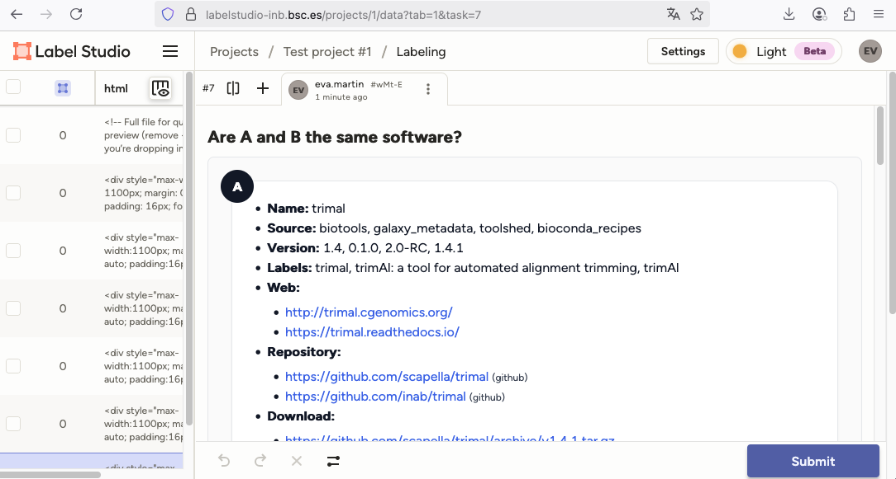

# Pair renderer for Label Studio

This utility builds side-by-side HTML panels from two software metadata documents (e.g., BioConda, bio.tools, Galaxy metadata) so they can be annotated in [Label Studio](https://labelstudio-inb.bsc.es).

The goal is to help human annotators decide whether two records refer to the same software.


## What it currently does
- Takes two JSON “tool docs” shaped like the metadata in our pipeline.
- Uses a Jinja2 template (pair_panels.html.j2) to render each doc into a clean HTML panel (“A” and “B”).
- Adds inline styles so the HTML renders reliably inside Label Studio.
- Supports common fields: name, source, version, labels, repository, webpage, download, documentation, authors, license, description, input, output, etc.
- Handles missing/optional fields gracefully.
- Includes a helper (assignment.py) to assign 3 annotators per pair and generate a balanced set of Label Studio tasks.

## How to render a single pair
1.	Place your two JSON docs on disk, e.g. docA.json and docB.json.
2.	Run the renderer script:
    ```python
    python render_pair.py docA.json docB.json
    ```

This will output the combined HTML to preview_pair.html.

## How to generate annotation tasks for multiple pairs

If you have a list of pairs and want each pair annotated by 3 different annotators (balanced across all annotators):
1. Edit assignment.py to list your pairs and annotators.
2. Run:
    ```python
    python assignment.py
    ```

3. This produces a tasks.json file in JSON array format, which Label Studio accepts.
Each task includes:
   - the rendered HTML (`data.html`)
   - the pair_id
   - the assigned annotator

    Example task: 

    ```json
    {
    "id": "a0e7f8b9-1234-5678-9012-abcdef123456",
    "data": {
        "pair_id": "pair-001",
        "annotator": "Captain Curator",
        "html": "<div>…rendered HTML…</div>"
    }
    }
    ```


## Using in Label Studio
1.	In your project, set the labeling interface config to something like the content of labelstudio_config.html.
2.	Import tasks.json from assignment.py (not the raw HTML).
3.	Annotators will see two panels (A and B) and answer whether they are the same software.
    

